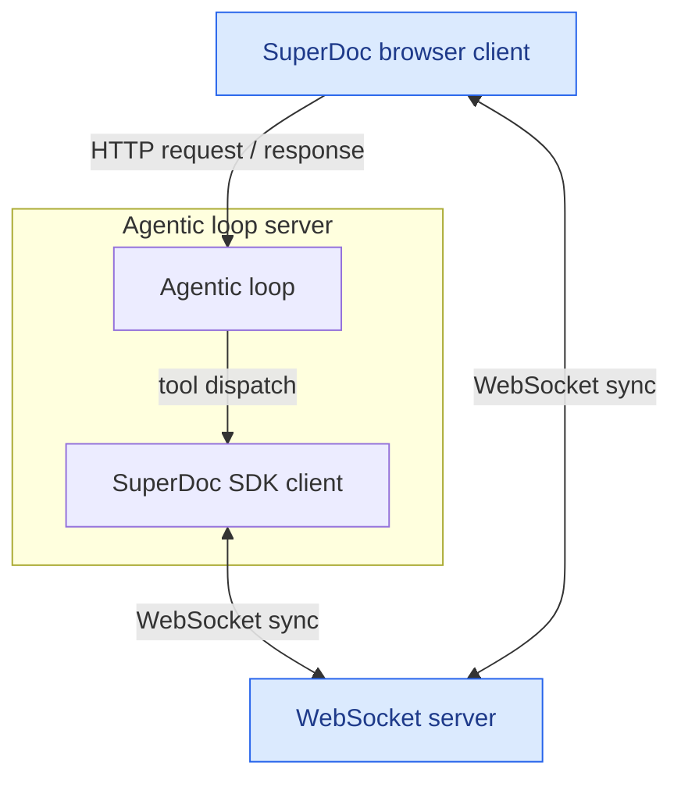

# Agent harness integration

This demo connects a server-side agent harness and a browser-based SuperDoc editor to the same collaborative document.

## Architecture



## Run the demo

Requires Node.js 22.12 or newer and pnpm 10.

```bash
pnpm install
cp .env.example .env
```

Add your OpenAI API key to `.env`:

```dotenv
OPENAI_API_KEY=your-key
OPENAI_MODEL=gpt-4.1-mini
```

Start the browser app, agent-loop server, and WebSocket server:

```bash
pnpm dev
```

Open [http://localhost:5173](http://localhost:5173), enter a document instruction, and select **Run agent**.
