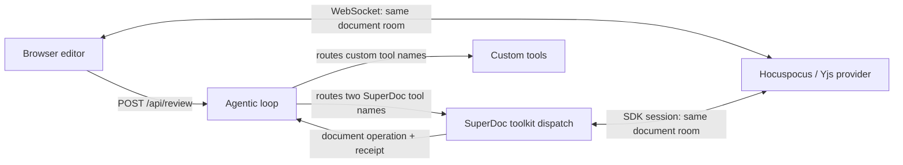

# Agent harness integration

This example adds SuperDoc document tools to an existing contract-review harness and shows the server-side agent's edits live in the browser.

The browser does not communicate with the agent process directly. It submits a review request over the application's HTTP API. The browser and the agent independently join the same Hocuspocus room, which carries document updates in both directions.



Open [architecture.html](./architecture.html) for a rendered version of this diagram.

## What it demonstrates

- `src/agentic-loop.ts` imports both tool families, runs the OpenAI tool loop, branches dispatch by tool family, and exposes the review route.
- `src/custom-tools.ts` contains two stand-in tools an existing product might already own: clause identification and playbook guidance.
- `src/superdoc-tools.ts` owns the SDK document connection, SuperDoc tool definitions, prompt, dispatch, and cleanup.
- `src/ws-server.ts` mounts Hocuspocus WebSocket handling on a minimal Fastify server. It intentionally has no authentication or persistence.

## Run

Requires Node 22.12 or newer and pnpm 10.

Set `OPENAI_API_KEY`. You can optionally override the default model with `OPENAI_MODEL`.

```bash
pnpm install
pnpm dev
```

Open `http://localhost:5173/`, enter an instruction, then select **Run agent**. The server-side harness creates the room from the sample DOCX during startup and keeps its SDK document session connected. The browser joins that room when it opens.

The review worker can remain connected after the browser closes. Reopen the page after the review completes to join the room and see its current state.

## Production boundary

The in-memory Hocuspocus server makes the collaboration topology visible but is not a production service. Add authentication and persistence to a self-hosted Hocuspocus deployment, or configure a supported managed provider such as Liveblocks. The room identifier must be authorized by the application, and the agent should use its own identity so tracked changes identify the automation that proposed them.

## Verify

```bash
pnpm typecheck
pnpm build
```
