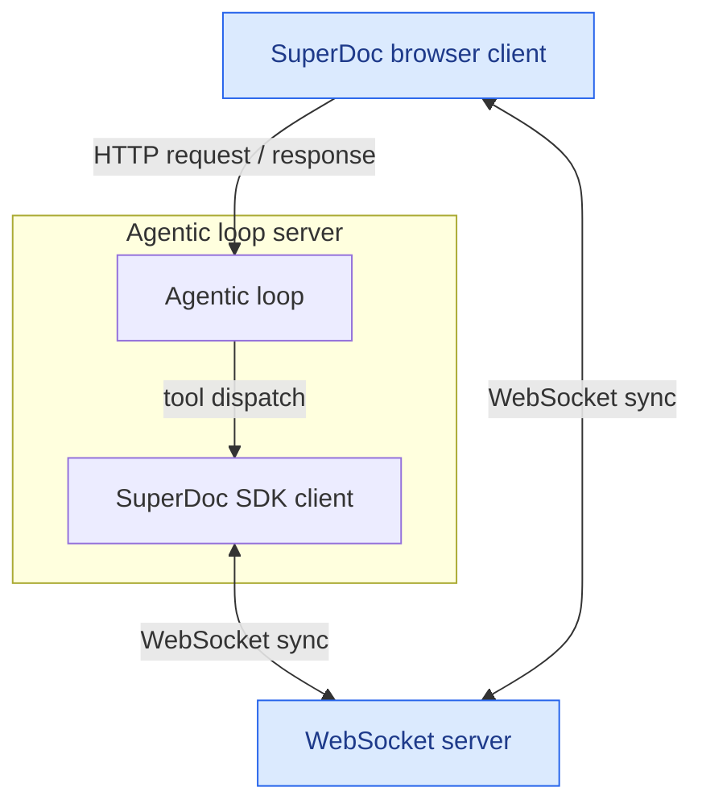

# Agent harness integration

```mermaid
flowchart TD
  webapp[SuperDoc browser client]

  subgraph server[Agentic loop server]
    direction TB
    loop[Agentic loop]
    client[SuperDoc SDK client]
    loop -->|tool dispatch| client
  end

  ws[WebSocket server]

  webapp -->|HTTP request / response| loop
  client <-->|WebSocket sync| ws
  webapp <-->|WebSocket sync| ws

  classDef blue fill:#dbeafe,stroke:#2563eb,color:#1e3a8a
  class webapp,ws blue
```
